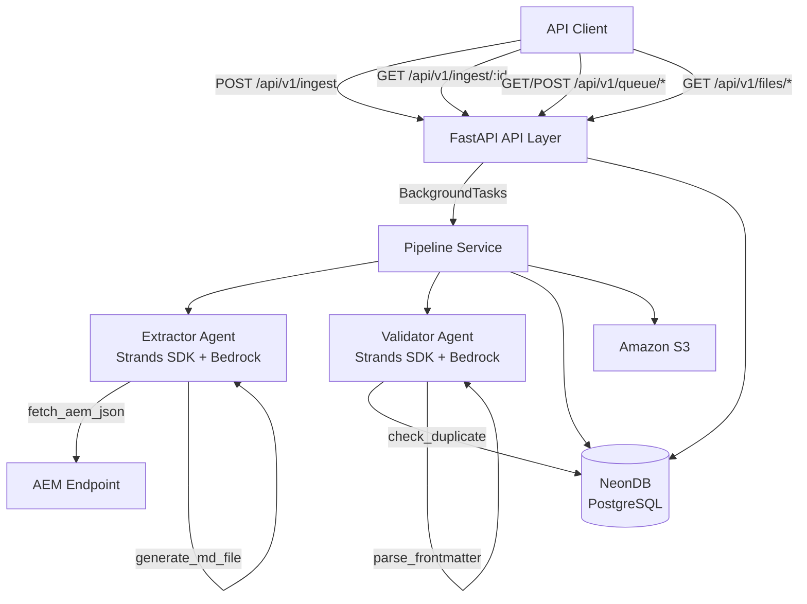
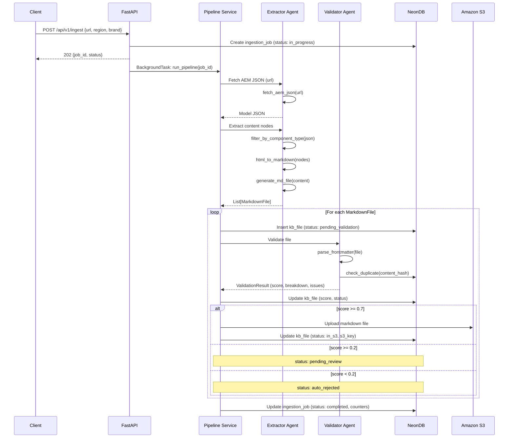
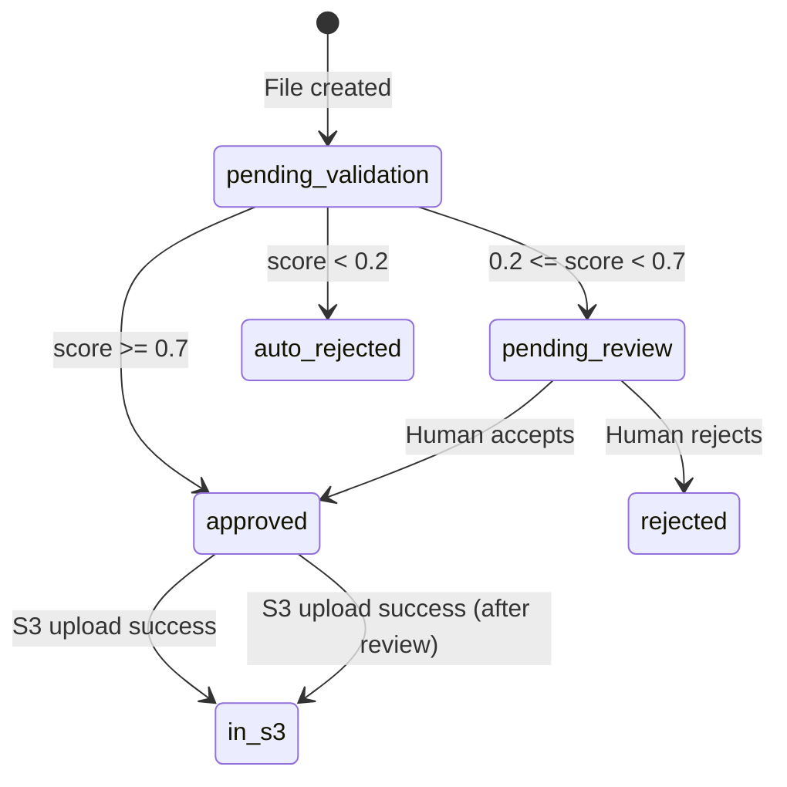

# Design Document: AEM Knowledge Base Ingestion System

## Overview

The AEM Knowledge Base Ingestion System is a Python-based pipeline that fetches content from Adobe Experience Manager (AEM) model.json endpoints, extracts meaningful content nodes, transforms them into standalone Markdown files with YAML frontmatter, validates them using AI agents, and routes them based on quality scores. The system is built on FastAPI with two AI agents powered by AWS Strands Agents SDK and Amazon Bedrock (Claude Sonnet).

The pipeline follows a sequential flow: Fetch → Extract → Insert to DB → Validate → Route → Upload approved → Complete job. All files are tracked through their full lifecycle in NeonDB (PostgreSQL), with approved files uploaded to Amazon S3.

### Key Design Decisions

1. **Two-agent architecture**: Separation of extraction and validation concerns allows independent scaling and evolution of each agent's capabilities.
2. **Background task execution**: FastAPI BackgroundTasks handles async pipeline execution, returning 202 immediately to the caller while processing continues.
3. **Content-hash-based deduplication**: SHA-256 of markdown body (excluding frontmatter) enables idempotent re-ingestion without storing full content comparisons.
4. **Score-based routing with human review**: Three-tier routing (auto-approve ≥ 0.7, review 0.2–0.7, auto-reject < 0.2) balances automation with quality control.
5. **asyncpg for database access**: Native async PostgreSQL driver for non-blocking DB operations within the async FastAPI stack.

## Architecture



### Pipeline Sequence



## Components and Interfaces

### Project Structure

```
aem-kb-system/
├── pyproject.toml
├── .env.example
├── src/
│   ├── main.py                  # FastAPI app factory, lifespan events
│   ├── config.py                # Pydantic Settings for env vars
│   ├── api/
│   │   ├── router.py            # Top-level APIRouter aggregation
│   │   ├── ingest.py            # POST /ingest, GET /ingest/{job_id}
│   │   ├── queue.py             # GET/POST /queue endpoints
│   │   └── files.py             # GET /files endpoints
│   ├── agents/
│   │   ├── extractor.py         # Extractor Agent definition
│   │   └── validator.py         # Validator Agent definition
│   ├── tools/
│   │   ├── fetch_aem.py         # fetch_aem_json tool
│   │   ├── filter_components.py # filter_by_component_type tool
│   │   ├── html_converter.py    # html_to_markdown tool
│   │   ├── md_generator.py      # generate_md_file tool
│   │   ├── duplicate_checker.py # check_duplicate tool
│   │   └── frontmatter_parser.py# parse_frontmatter tool
│   ├── services/
│   │   ├── pipeline.py          # Pipeline orchestration
│   │   └── s3_upload.py         # S3 upload service
│   ├── db/
│   │   ├── connection.py        # asyncpg pool management
│   │   ├── queries.py           # SQL query functions
│   │   └── migrations/
│   │       └── 001_initial.sql  # Initial schema migration
│   └── models/
│       └── schemas.py           # Pydantic models
└── tests/
```


### Component Interfaces

#### 1. Configuration (`src/config.py`)

```python
from pydantic_settings import BaseSettings

class Settings(BaseSettings):
    # Database
    database_url: str                    # NeonDB connection string
    
    # AWS
    aws_region: str = "us-east-1"
    s3_bucket_name: str
    bedrock_model_id: str = "us.anthropic.claude-sonnet-4-20250514-v1:0"
    
    # AEM
    aem_request_timeout: int = 30        # seconds
    
    # Validation thresholds
    auto_approve_threshold: float = 0.7
    auto_reject_threshold: float = 0.2
    
    # Component filtering
    allowlist: list[str]                 # e.g. ["*/accordionitem", "*/text", ...]
    denylist: list[str]                  # e.g. ["*/responsivegrid", "*/container", ...]
    
    class Config:
        env_file = ".env"
```

#### 2. Extractor Agent (`src/agents/extractor.py`)

```python
from strands import Agent
from strands.models.bedrock import BedrockModel

class ExtractorAgent:
    """Wraps the Strands Agent with extraction tools."""
    
    def __init__(self, settings: Settings):
        model = BedrockModel(model_id=settings.bedrock_model_id)
        self.agent = Agent(
            model=model,
            tools=[fetch_aem_json, filter_by_component_type, html_to_markdown, generate_md_file],
            system_prompt="..."
        )
    
    async def extract(self, url: str, region: str, brand: str) -> list[MarkdownFile]:
        """Fetch AEM JSON and extract content nodes into markdown files."""
        ...
```

#### 3. Validator Agent (`src/agents/validator.py`)

```python
class ValidatorAgent:
    """Wraps the Strands Agent with validation tools."""
    
    def __init__(self, settings: Settings, db_pool: asyncpg.Pool):
        model = BedrockModel(model_id=settings.bedrock_model_id)
        self.agent = Agent(
            model=model,
            tools=[check_duplicate, parse_frontmatter],
            system_prompt="..."
        )
    
    async def validate(self, md_file: MarkdownFile) -> ValidationResult:
        """Score a markdown file on metadata, semantics, and uniqueness."""
        ...
```

#### 4. Tool Definitions (`src/tools/`)

Each tool uses the `@tool` decorator from `strands.tools`:

```python
from strands.tools import tool
from strands import ToolError

@tool
def fetch_aem_json(url: str) -> dict:
    """Fetch and parse JSON from an AEM model.json endpoint."""
    ...

@tool
def filter_by_component_type(
    model_json: dict, 
    allowlist: list[str], 
    denylist: list[str]
) -> list[ContentNode]:
    """Recursively traverse :items and filter by component type."""
    ...

@tool
def html_to_markdown(html_content: str) -> str:
    """Convert HTML to clean Markdown using markdownify."""
    ...

@tool
def generate_md_file(
    content: str, 
    metadata: dict, 
    region: str, 
    brand: str
) -> MarkdownFile:
    """Generate a Markdown file with YAML frontmatter."""
    ...

@tool
def check_duplicate(content_hash: str, db_pool: asyncpg.Pool) -> DuplicateCheckResult:
    """Check if content_hash exists in kb_files table."""
    ...

@tool
def parse_frontmatter(md_content: str) -> FrontmatterResult:
    """Parse YAML frontmatter and validate required fields."""
    ...
```

#### 5. Pipeline Service (`src/services/pipeline.py`)

```python
class PipelineService:
    def __init__(
        self, 
        extractor: ExtractorAgent, 
        validator: ValidatorAgent,
        db_pool: asyncpg.Pool,
        s3_service: S3UploadService,
        settings: Settings
    ):
        ...
    
    async def run(self, job_id: UUID, url: str, region: str, brand: str) -> None:
        """Execute the full ingestion pipeline for a job."""
        # 1. Fetch & extract
        # 2. Insert each file to DB (pending_validation)
        # 3. Validate each file
        # 4. Route based on score
        # 5. Upload approved files to S3
        # 6. Update job status to completed
        ...
```

#### 6. S3 Upload Service (`src/services/s3_upload.py`)

```python
class S3UploadService:
    def __init__(self, s3_client, bucket_name: str):
        ...
    
    async def upload(self, file: MarkdownFile) -> S3UploadResult:
        """Upload markdown file to S3 with structured key."""
        # Key: knowledge-base/{content_type}/{YYYY-MM}/{filename}
        # ContentType: text/markdown
        # Metadata: file_id, content_hash
        ...
```

#### 7. Database Layer (`src/db/`)

```python
# connection.py
async def create_pool(database_url: str) -> asyncpg.Pool:
    """Create asyncpg connection pool with SSL."""
    return await asyncpg.create_pool(database_url, ssl="require")

# queries.py
async def insert_kb_file(pool: asyncpg.Pool, file: KBFileCreate) -> UUID: ...
async def update_kb_file_status(pool: asyncpg.Pool, file_id: UUID, status: str, **kwargs) -> None: ...
async def get_kb_file(pool: asyncpg.Pool, file_id: UUID) -> KBFileRecord | None: ...
async def list_kb_files(pool: asyncpg.Pool, filters: FileFilters, page: int, size: int) -> list[KBFileRecord]: ...
async def find_by_content_hash(pool: asyncpg.Pool, content_hash: str) -> KBFileRecord | None: ...
async def insert_ingestion_job(pool: asyncpg.Pool, job: IngestionJobCreate) -> UUID: ...
async def update_ingestion_job(pool: asyncpg.Pool, job_id: UUID, **kwargs) -> None: ...
async def get_ingestion_job(pool: asyncpg.Pool, job_id: UUID) -> IngestionJobRecord | None: ...
```

#### 8. API Layer (`src/api/`)

```python
# ingest.py
@router.post("/ingest", status_code=202)
async def start_ingestion(body: IngestRequest, background_tasks: BackgroundTasks) -> IngestResponse: ...

@router.get("/ingest/{job_id}")
async def get_job_status(job_id: UUID) -> IngestionJobResponse: ...

# queue.py
@router.get("/queue")
async def list_review_queue(
    region: str | None = None, brand: str | None = None,
    content_type: str | None = None, component_type: str | None = None,
    page: int = 1, size: int = 20
) -> PaginatedResponse[QueueItemSummary]: ...

@router.get("/queue/{file_id}")
async def get_queue_item(file_id: UUID) -> QueueItemDetail: ...

@router.post("/queue/{file_id}/accept")
async def accept_file(file_id: UUID, body: AcceptRequest) -> QueueActionResponse: ...

@router.post("/queue/{file_id}/reject")
async def reject_file(file_id: UUID, body: RejectRequest) -> QueueActionResponse: ...

@router.put("/queue/{file_id}/update")
async def update_file(file_id: UUID, body: UpdateRequest) -> QueueActionResponse: ...

# files.py
@router.get("/files")
async def list_files(
    status: str | None = None, region: str | None = None, brand: str | None = None,
    content_type: str | None = None, component_type: str | None = None,
    page: int = 1, size: int = 20
) -> PaginatedResponse[FileSummary]: ...

@router.get("/files/{file_id}")
async def get_file(file_id: UUID) -> FileDetail: ...
```


## Data Models

### Pydantic Schemas (`src/models/schemas.py`)

```python
from pydantic import BaseModel, Field, HttpUrl
from uuid import UUID
from datetime import datetime
from enum import Enum

# --- Enums ---

class FileStatus(str, Enum):
    PENDING_VALIDATION = "pending_validation"
    APPROVED = "approved"
    PENDING_REVIEW = "pending_review"
    AUTO_REJECTED = "auto_rejected"
    IN_S3 = "in_s3"
    REJECTED = "rejected"

class JobStatus(str, Enum):
    IN_PROGRESS = "in_progress"
    COMPLETED = "completed"
    FAILED = "failed"

# --- Internal Models ---

class ContentNode(BaseModel):
    """A single content node extracted from AEM JSON."""
    node_type: str                       # :type value
    aem_node_id: str                     # path/key in the JSON tree
    html_content: str                    # raw HTML from the node
    parent_context: str                  # parent node path
    metadata: dict                       # additional node metadata

class MarkdownFile(BaseModel):
    """A generated markdown file with frontmatter."""
    filename: str
    title: str
    content_type: str
    source_url: str
    component_type: str
    aem_node_id: str
    md_content: str                      # full markdown with frontmatter
    md_body: str                         # markdown body only (no frontmatter)
    content_hash: str                    # SHA-256 of md_body
    modify_date: datetime
    extracted_at: datetime
    parent_context: str
    region: str
    brand: str

class ValidationBreakdown(BaseModel):
    metadata_completeness: float = Field(ge=0.0, le=0.3)
    semantic_quality: float = Field(ge=0.0, le=0.5)
    uniqueness: float = Field(ge=0.0, le=0.2)

class ValidationResult(BaseModel):
    score: float = Field(ge=0.0, le=1.0)
    breakdown: ValidationBreakdown
    issues: list[str]

class S3UploadResult(BaseModel):
    s3_bucket: str
    s3_key: str
    s3_uploaded_at: datetime

class DuplicateCheckResult(BaseModel):
    is_duplicate: bool
    existing_file_id: UUID | None = None

class FrontmatterResult(BaseModel):
    metadata: dict
    body: str
    missing_fields: list[str]
    valid: bool

# --- API Request/Response Models ---

class IngestRequest(BaseModel):
    url: HttpUrl
    region: str
    brand: str

class IngestResponse(BaseModel):
    job_id: UUID
    status: JobStatus

class AcceptRequest(BaseModel):
    reviewed_by: str

class RejectRequest(BaseModel):
    reviewed_by: str
    review_notes: str

class UpdateRequest(BaseModel):
    md_content: str

class QueueActionResponse(BaseModel):
    file_id: UUID
    status: FileStatus
    message: str

class QueueItemSummary(BaseModel):
    id: UUID
    filename: str
    title: str
    content_type: str
    component_type: str
    region: str
    brand: str
    validation_score: float
    created_at: datetime

class QueueItemDetail(BaseModel):
    id: UUID
    filename: str
    title: str
    content_type: str
    component_type: str
    source_url: str
    aem_node_id: str
    md_content: str
    region: str
    brand: str
    validation_score: float
    validation_breakdown: ValidationBreakdown
    validation_issues: list[str]
    created_at: datetime
    updated_at: datetime

class FileSummary(BaseModel):
    id: UUID
    filename: str
    title: str
    content_type: str
    status: FileStatus
    region: str
    brand: str
    validation_score: float | None
    created_at: datetime

class FileDetail(BaseModel):
    id: UUID
    filename: str
    title: str
    content_type: str
    content_hash: str
    source_url: str
    component_type: str
    aem_node_id: str
    md_content: str
    modify_date: datetime
    parent_context: str
    region: str
    brand: str
    validation_score: float | None
    validation_breakdown: ValidationBreakdown | None
    validation_issues: list[str] | None
    status: FileStatus
    s3_bucket: str | None
    s3_key: str | None
    s3_uploaded_at: datetime | None
    reviewed_by: str | None
    reviewed_at: datetime | None
    review_notes: str | None
    created_at: datetime
    updated_at: datetime

class IngestionJobResponse(BaseModel):
    id: UUID
    source_url: str
    status: JobStatus
    total_nodes_found: int | None
    files_created: int
    files_auto_approved: int
    files_pending_review: int
    files_auto_rejected: int
    error_message: str | None
    started_at: datetime
    completed_at: datetime | None

class PaginatedResponse(BaseModel):
    items: list
    total: int
    page: int
    size: int
    pages: int
```

### Database Schema (`src/db/migrations/001_initial.sql`)

```sql
CREATE EXTENSION IF NOT EXISTS "uuid-ossp";

CREATE TABLE kb_files (
    id              UUID PRIMARY KEY DEFAULT uuid_generate_v4(),
    filename        TEXT NOT NULL,
    title           TEXT NOT NULL,
    content_type    TEXT NOT NULL,
    content_hash    TEXT NOT NULL,
    source_url      TEXT NOT NULL,
    component_type  TEXT NOT NULL,
    aem_node_id     TEXT NOT NULL,
    md_content      TEXT NOT NULL,
    modify_date     TIMESTAMPTZ,
    parent_context  TEXT,
    region          TEXT NOT NULL,
    brand           TEXT NOT NULL,
    validation_score    FLOAT,
    validation_breakdown JSONB,
    validation_issues   JSONB,
    status          TEXT NOT NULL DEFAULT 'pending_validation',
    s3_bucket       TEXT,
    s3_key          TEXT,
    s3_uploaded_at  TIMESTAMPTZ,
    reviewed_by     TEXT,
    reviewed_at     TIMESTAMPTZ,
    review_notes    TEXT,
    created_at      TIMESTAMPTZ NOT NULL DEFAULT NOW(),
    updated_at      TIMESTAMPTZ NOT NULL DEFAULT NOW()
);

CREATE TABLE ingestion_jobs (
    id                  UUID PRIMARY KEY DEFAULT uuid_generate_v4(),
    source_url          TEXT NOT NULL,
    status              TEXT NOT NULL DEFAULT 'in_progress',
    total_nodes_found   INTEGER,
    files_created       INTEGER NOT NULL DEFAULT 0,
    files_auto_approved INTEGER NOT NULL DEFAULT 0,
    files_pending_review INTEGER NOT NULL DEFAULT 0,
    files_auto_rejected INTEGER NOT NULL DEFAULT 0,
    duplicates_skipped  INTEGER NOT NULL DEFAULT 0,
    error_message       TEXT,
    started_at          TIMESTAMPTZ NOT NULL DEFAULT NOW(),
    completed_at        TIMESTAMPTZ
);

-- Indexes for kb_files
CREATE INDEX idx_kb_files_content_hash ON kb_files (content_hash);
CREATE INDEX idx_kb_files_status ON kb_files (status);
CREATE INDEX idx_kb_files_region ON kb_files (region);
CREATE INDEX idx_kb_files_brand ON kb_files (brand);
CREATE INDEX idx_kb_files_source_url ON kb_files (source_url);
CREATE INDEX idx_kb_files_content_type ON kb_files (content_type);
CREATE INDEX idx_kb_files_created_at ON kb_files (created_at);

-- Indexes for ingestion_jobs
CREATE INDEX idx_ingestion_jobs_status ON ingestion_jobs (status);
```

### Status Lifecycle State Machine



### AEM JSON Traversal Algorithm

The `filter_by_component_type` tool recursively traverses the AEM model.json structure:

```
function traverse(node, parent_path, allowlist, denylist):
    results = []
    if node has ":items":
        for key, child in node[":items"]:
            child_path = parent_path + "/" + key
            if child has ":type":
                type = child[":type"]
                if matches_any(type, denylist):
                    continue  // skip denied types
                if matches_any(type, allowlist):
                    results.append(ContentNode(child, child_path))
            // recurse into nested :items regardless of match
            results.extend(traverse(child, child_path, allowlist, denylist))
    return results

function matches_any(type, patterns):
    // glob-style suffix matching: "*/text" matches "core/components/text"
    for pattern in patterns:
        suffix = pattern.removeprefix("*/")
        if type.endswith(suffix):
            return true
    return false
```

### Content Hash Computation

```python
import hashlib

def compute_content_hash(md_body: str) -> str:
    """SHA-256 of markdown body only, excluding frontmatter."""
    return hashlib.sha256(md_body.encode("utf-8")).hexdigest()
```


## Correctness Properties

*A property is a characteristic or behavior that should hold true across all valid executions of a system — essentially, a formal statement about what the system should do. Properties serve as the bridge between human-readable specifications and machine-verifiable correctness guarantees.*

### Property 1: Fetch error sets job to failed

*For any* AEM endpoint response that is either a non-200 HTTP status code or an invalid JSON body, the system shall set the corresponding Ingestion_Job status to `failed` and record a non-empty error message.

**Validates: Requirements 1.2, 1.4**

### Property 2: Recursive traversal discovers all typed nodes

*For any* Model_JSON containing arbitrarily nested `:items` objects, the traversal algorithm shall discover every node that has a `:type` field, regardless of nesting depth.

**Validates: Requirements 2.1**

### Property 3: Component type filtering correctness

*For any* set of nodes discovered during traversal, a node appears in the extraction results if and only if its `:type` matches an entry in the Allowlist and does not match any entry in the Denylist. Denylist takes precedence over Allowlist.

**Validates: Requirements 2.2, 2.3**

### Property 4: Node count invariant

*For any* extraction run, the `total_nodes_found` recorded in the Ingestion_Job shall equal the number of Content_Nodes that passed the Allowlist/Denylist filtering.

**Validates: Requirements 2.4**

### Property 5: Parent context path preservation

*For any* extracted Content_Node, its `parent_context` field shall accurately reflect the path of parent node keys from the root of the JSON tree to the node's immediate parent.

**Validates: Requirements 2.5**

### Property 6: One-to-one node-to-file mapping

*For any* list of extracted Content_Nodes, the number of generated Markdown_Files shall equal the number of Content_Nodes (exactly one file per node).

**Validates: Requirements 3.1**

### Property 7: HTML to Markdown conversion removes HTML tags

*For any* HTML content string passed to the html_to_markdown tool, the output shall not contain any HTML block-level or inline tags (e.g., `<div>`, `<p>`, `<span>`, `<a>`), only clean Markdown syntax.

**Validates: Requirements 3.2**

### Property 8: Generated frontmatter contains all required fields

*For any* generated Markdown_File, parsing the YAML frontmatter shall yield all required fields (title, content_type, source_url, component_type, aem_node_id, modify_date, extracted_at, parent_context, region, brand) with non-empty values, where modify_date and extracted_at are valid ISO 8601 UTC timestamps, and region and brand match the ingestion request parameters.

**Validates: Requirements 3.3, 3.4, 3.5, 3.7**

### Property 9: Content hash excludes frontmatter

*For any* Markdown_File, the `content_hash` shall equal the SHA-256 hex digest of the markdown body only (the content after the closing `---` of the YAML frontmatter block). Two files with identical bodies but different frontmatter shall have the same content_hash.

**Validates: Requirements 3.6**

### Property 10: Validation sub-scores within defined ranges

*For any* ValidationResult, `metadata_completeness` shall be in [0.0, 0.3], `semantic_quality` shall be in [0.0, 0.5], and `uniqueness` shall be in [0.0, 0.2].

**Validates: Requirements 4.1, 4.2, 4.3**

### Property 11: Validation score is sum of sub-scores

*For any* ValidationResult, the `score` field shall equal `metadata_completeness + semantic_quality + uniqueness` (within floating-point tolerance).

**Validates: Requirements 4.4**

### Property 12: Score-based routing correctness

*For any* Markdown_File with a Validation_Score, the file status shall be set to: `approved` if score ≥ 0.7, `pending_review` if 0.2 ≤ score < 0.7, `auto_rejected` if score < 0.2.

**Validates: Requirements 5.1, 5.2, 5.3**

### Property 13: Validation data always persisted

*For any* Markdown_File that has been validated, the KB_Files_Table record shall contain a non-null validation_score, validation_breakdown, and validation_issues, regardless of the routing outcome.

**Validates: Requirements 5.4**

### Property 14: S3 upload key structure and metadata

*For any* file uploaded to S3, the key shall match the pattern `knowledge-base/{content_type}/{YYYY-MM}/{filename}`, the ContentType shall be `text/markdown`, and the object metadata shall include `file_id` and `content_hash`.

**Validates: Requirements 6.2, 6.3**

### Property 15: Approved files transition to in_s3 after upload

*For any* Markdown_File with status `approved` that is successfully uploaded to S3, the status shall be updated to `in_s3` and the `s3_bucket`, `s3_key`, and `s3_uploaded_at` fields shall be non-null.

**Validates: Requirements 6.1, 6.4**

### Property 16: Initial file status is pending_validation

*For any* newly created Markdown_File record in the KB_Files_Table, the initial status shall be `pending_validation`.

**Validates: Requirements 7.1**

### Property 17: Status transitions follow lifecycle rules

*For any* status transition attempt on a KB_File, only the following transitions shall be permitted: `pending_validation` → {`approved`, `pending_review`, `auto_rejected`}, `approved` → {`in_s3`}, `pending_review` → {`approved`, `rejected`}. All other transitions shall be rejected.

**Validates: Requirements 7.4**

### Property 18: Status change updates timestamp

*For any* status change on a KB_File, the `updated_at` field shall be set to a timestamp greater than or equal to the previous `updated_at` value.

**Validates: Requirements 7.3**

### Property 19: Job completion records accurate counters

*For any* completed Ingestion_Job, the sum of `files_auto_approved + files_pending_review + files_auto_rejected + duplicates_skipped` shall equal the total number of Content_Nodes processed, and `files_created` shall equal `files_auto_approved + files_pending_review + files_auto_rejected`.

**Validates: Requirements 8.3**

### Property 20: Duplicate content hash skips file creation

*For any* Content_Node whose computed content_hash already exists in the KB_Files_Table, the Pipeline_Service shall not create a new record and shall increment the `duplicates_skipped` counter on the Ingestion_Job.

**Validates: Requirements 9.1, 9.2**

### Property 21: Valid ingest request returns 202 with job_id

*For any* POST request to `/api/v1/ingest` with a valid URL, non-empty region, and non-empty brand, the API shall return HTTP 202 with a response body containing a UUID `job_id` and status `in_progress`.

**Validates: Requirements 10.1, 10.2**

### Property 22: Invalid ingest request returns 422

*For any* POST request to `/api/v1/ingest` where the `url` is missing or not a valid URL, or `region` is missing, or `brand` is missing, the API shall return HTTP 422 with a descriptive error message.

**Validates: Requirements 10.3, 10.4**

### Property 23: Queue listing returns only pending_review files matching filters

*For any* GET request to `/api/v1/queue` with filter parameters, every returned file shall have status `pending_review` and match all specified filter values (region, brand, content_type, component_type).

**Validates: Requirements 12.1**

### Property 24: Accept sets status to approved with review metadata

*For any* pending_review file that receives an accept action with a `reviewed_by` value, the file status shall be set to `approved`, `reviewed_by` shall be recorded, and `reviewed_at` shall be set to a valid timestamp.

**Validates: Requirements 12.4**

### Property 25: Reject sets status to rejected with review metadata

*For any* pending_review file that receives a reject action with `reviewed_by` and `review_notes`, the file status shall be set to `rejected`, and both `reviewed_by`, `reviewed_at`, and `review_notes` shall be recorded.

**Validates: Requirements 12.5**

### Property 26: Content update recomputes hash without changing status

*For any* PUT request to update a file's `md_content`, the `content_hash` shall be recomputed as SHA-256 of the new body, `updated_at` shall be refreshed, and the file `status` shall remain unchanged.

**Validates: Requirements 12.6**

### Property 27: Files listing respects filters

*For any* GET request to `/api/v1/files` with filter parameters, every returned file shall match all specified filter values (status, region, brand, content_type, component_type).

**Validates: Requirements 13.1**

### Property 28: Markdown frontmatter round-trip

*For any* valid Markdown_File produced by the Extractor_Agent, parsing the file with python-frontmatter, re-serializing the parsed metadata and body, and parsing again shall yield equivalent frontmatter metadata and an equivalent Markdown body.

**Validates: Requirements 15.1, 15.2, 15.3**


## Error Handling

### HTTP Fetch Errors

| Error Condition | Handling |
|---|---|
| Non-200 HTTP status | Record status code and response body in `error_message`, set job status to `failed` |
| Connection timeout (30s) | Abort request, record timeout error, set job status to `failed` |
| Invalid JSON response | Record parse error details, set job status to `failed` |
| DNS resolution failure | Record connection error, set job status to `failed` |

### AEM JSON Processing Errors

| Error Condition | Handling |
|---|---|
| Missing `:items` at root | Treat as empty content, set `total_nodes_found = 0`, complete job with zero files |
| Missing `dataLayer` / `repo:modifyDate` | Set `modify_date` to null, log warning, continue processing |
| HTML conversion failure | Log error for specific node, skip node, continue with remaining nodes |

### Validation Errors

| Error Condition | Handling |
|---|---|
| Frontmatter parse failure | Score metadata_completeness as 0.0, record issue |
| Bedrock API error | Retry up to 3 times with exponential backoff, then set file to `pending_review` for human evaluation |
| Duplicate check DB error | Score uniqueness as 0.0, log error, continue validation |

### S3 Upload Errors

| Error Condition | Handling |
|---|---|
| Upload failure (network/permissions) | Retain `approved` status, log error with details for retry |
| Bucket not found | Log critical error, retain `approved` status |

### API Input Validation Errors

| Error Condition | Handling |
|---|---|
| Missing/invalid URL | Return 422 with field-level error message |
| Missing region or brand | Return 422 indicating missing required fields |
| Non-existent job_id or file_id | Return 404 |
| Queue action on non-pending_review file | Return 404 |
| Invalid status transition | Return 409 Conflict with current status info |

### Database Errors

| Error Condition | Handling |
|---|---|
| Connection pool exhausted | Return 503 Service Unavailable, log warning |
| Constraint violation | Return 409 Conflict with details |
| Query timeout | Retry once, then return 500 |

### Agent Errors

All Strands agent tool errors use `ToolError` for recoverable errors. Unrecoverable errors propagate to the pipeline service which catches them and sets the job status to `failed`.


## Testing Strategy

### Testing Framework and Libraries

- **Test runner**: pytest with pytest-asyncio
- **Property-based testing**: Hypothesis (Python)
- **HTTP mocking**: respx (for httpx async mocking)
- **Database testing**: asyncpg with test database or testcontainers-python
- **S3 mocking**: moto (AWS service mocking)
- **API testing**: httpx.AsyncClient with FastAPI TestClient

### Property-Based Tests (Hypothesis)

Each correctness property from the design document shall be implemented as a single Hypothesis property test with a minimum of 100 examples per test run. Each test shall be tagged with a comment referencing the design property.

```python
# Example tag format:
# Feature: aem-kb-ingestion, Property 3: Component type filtering correctness
```

Key property tests:

1. **Properties 2, 3, 4, 5** — Generate random nested JSON trees with `:items` and `:type` fields. Verify traversal completeness, filtering correctness, count accuracy, and path preservation.
2. **Property 7** — Generate random HTML strings. Verify output contains no HTML tags.
3. **Property 8** — Generate random ContentNode data. Verify all frontmatter fields are present and valid.
4. **Property 9** — Generate random markdown with varying frontmatter. Verify hash is computed from body only.
5. **Properties 10, 11** — Generate random ValidationBreakdown values within ranges. Verify ranges and sum.
6. **Property 12** — Generate random scores in [0.0, 1.0]. Verify routing decision matches threshold rules.
7. **Property 17** — Generate random (current_status, target_status) pairs. Verify only valid transitions succeed.
8. **Property 19** — Generate random job processing results. Verify counter arithmetic.
9. **Property 20** — Generate random content hashes with some duplicates. Verify skip behavior.
10. **Properties 21, 22** — Generate random ingest request payloads. Verify 202 vs 422 responses.
11. **Properties 23, 27** — Generate random filter combinations and file sets. Verify filtering correctness.
12. **Property 26** — Generate random markdown content updates. Verify hash recomputation and status preservation.
13. **Property 28** — Generate random frontmatter metadata and markdown bodies. Verify parse-serialize-parse round-trip equivalence.

### Unit Tests

Unit tests complement property tests by covering specific examples, edge cases, and integration points:

- **Edge cases**: Empty `:items`, deeply nested structures (10+ levels), nodes with both allowlist and denylist matches, empty markdown body, zero-score validation
- **Error conditions**: Non-200 HTTP responses (400, 403, 404, 500), malformed JSON, S3 upload failures, database connection errors
- **Integration points**: Pipeline orchestration end-to-end with mocked agents, API endpoint request/response cycles, background task execution
- **Specific examples**: Known AEM JSON structures from real endpoints, specific component type matching patterns

### Test Configuration

```python
# conftest.py
from hypothesis import settings

settings.register_profile("ci", max_examples=200)
settings.register_profile("dev", max_examples=100)
settings.load_profile("dev")
```

### Test Organization

```
tests/
├── conftest.py                    # Shared fixtures, Hypothesis profiles
├── test_tools/
│   ├── test_fetch_aem.py          # Properties 1
│   ├── test_filter_components.py  # Properties 2, 3, 4, 5
│   ├── test_html_converter.py     # Property 7
│   ├── test_md_generator.py       # Properties 6, 8, 9
│   ├── test_duplicate_checker.py  # Property 20
│   └── test_frontmatter_parser.py # Property 28
├── test_services/
│   ├── test_pipeline.py           # Properties 12, 13, 16, 17, 18, 19
│   └── test_s3_upload.py          # Properties 14, 15
├── test_agents/
│   ├── test_extractor.py          # Integration tests
│   └── test_validator.py          # Properties 10, 11
├── test_api/
│   ├── test_ingest.py             # Properties 21, 22
│   ├── test_queue.py              # Properties 23, 24, 25, 26
│   └── test_files.py              # Property 27
└── test_db/
    └── test_queries.py            # DB query correctness
```
