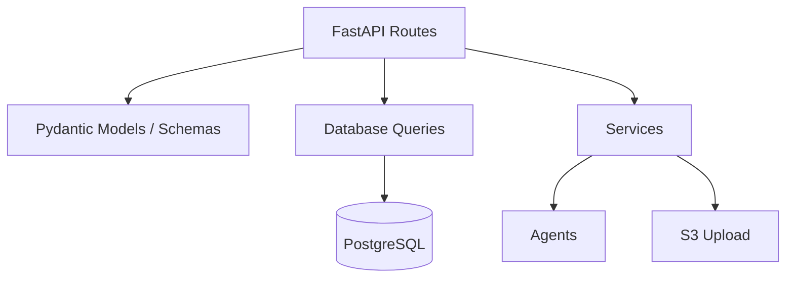
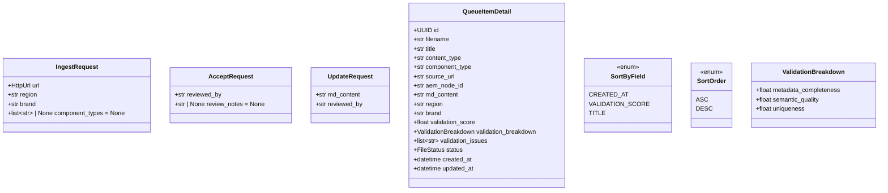

# Design Document: API Guide Corrections

## Overview

This design covers seven targeted corrections and gap-fills to the AEM Knowledge Base Ingestion System. The changes are scoped to Pydantic request/response models, FastAPI route handlers, database query functions, and the BACKEND_GUIDE.md documentation. No new tables, services, or agents are introduced. Each change is small and isolated, making them safe to implement incrementally.

### Summary of Changes

| # | Area | Code Files Touched | Guide Update |
|---|------|--------------------|--------------|
| 1 | `component_types` override on POST /ingest | `schemas.py`, `ingest.py`, `pipeline.py` | POST /ingest request table |
| 2 | Optional `review_notes` on accept | `schemas.py`, `queue.py` | POST /queue/{file_id}/accept request body |
| 3 | Required `reviewed_by` on update | `schemas.py`, `queue.py` | PUT /queue/{file_id}/update request body |
| 4 | Sort controls on list endpoints | `schemas.py`, `queue.py`, `files.py`, `queries.py` | GET /queue and GET /files param tables |
| 5 | Validation threshold docs | — | Validation Scoring section |
| 6 | Relax queue detail status restriction | `queue.py` | GET /queue/{file_id} errors section |
| 7 | Standardize breakdown field names | `validator.py`, `schemas.py` | All breakdown JSON examples |

## Architecture

The system follows a standard FastAPI layered architecture:



All seven changes operate within the existing layers. No new architectural components are needed.

- **Req 1, 2, 3**: Schema model additions + route handler plumbing
- **Req 4**: Schema additions + route handler params + query function changes
- **Req 5**: Documentation-only
- **Req 6**: Route handler logic change (remove status guard)
- **Req 7**: Field name audit across validator agent, schemas, and docs (already correct in code; verify and fix docs if needed)

## Components and Interfaces

### Requirement 1: Component Types Override

**IngestRequest model** (`src/models/schemas.py`):
```python
class IngestRequest(BaseModel):
    url: HttpUrl
    region: str
    brand: str
    component_types: list[str] | None = None  # NEW
```

**POST /ingest handler** (`src/api/ingest.py`):
- Pass `body.component_types` to `pipeline_service.run()` as a new keyword argument.

**PipelineService.run()** (`src/services/pipeline.py`):
- Accept optional `component_types: list[str] | None = None` parameter.
- When not None, pass it to `self.extractor.extract()` instead of `self.settings.allowlist`.
- When None, use `self.settings.allowlist` as today.

### Requirement 2: Optional Review Notes on Accept

**AcceptRequest model** (`src/models/schemas.py`):
```python
class AcceptRequest(BaseModel):
    reviewed_by: str
    review_notes: str | None = None  # NEW
```

**POST /queue/{file_id}/accept handler** (`src/api/queue.py`):
- Pass `review_notes=body.review_notes` to `update_kb_file_status()`.

### Requirement 3: Reviewed-By on Update

**UpdateRequest model** (`src/models/schemas.py`):
```python
class UpdateRequest(BaseModel):
    md_content: str
    reviewed_by: str  # NEW — required
```

**PUT /queue/{file_id}/update handler** (`src/api/queue.py`):
- Pass `reviewed_by=body.reviewed_by` to `update_kb_file_status()`.

### Requirement 4: Sort Controls

**New enum** (`src/models/schemas.py`):
```python
class SortByField(str, Enum):
    CREATED_AT = "created_at"
    VALIDATION_SCORE = "validation_score"
    TITLE = "title"

class SortOrder(str, Enum):
    ASC = "asc"
    DESC = "desc"
```

**Route handlers** (`src/api/queue.py` and `src/api/files.py`):
- Add `sort_by: SortByField = SortByField.CREATED_AT` and `sort_order: SortOrder = SortOrder.DESC` query parameters.
- Pass them through to the query functions.

**Database queries** (`src/db/queries.py`):
- `list_kb_files()` and `list_review_queue()` accept `sort_by` and `sort_order` parameters.
- Use a safelist mapping to translate `sort_by` enum values to column names, preventing SQL injection:
```python
_SORT_COLUMN_MAP = {
    "created_at": "created_at",
    "validation_score": "validation_score",
    "title": "title",
}
```
- Validate `sort_by` against the safelist before interpolating into SQL.

### Requirement 5: Validation Threshold Documentation

Documentation-only change to BACKEND_GUIDE.md. Add a note to the Validation Scoring section:

> **Configurable Thresholds:** The auto-approve boundary is controlled by the `AUTO_APPROVE_THRESHOLD` environment variable (default `0.7`). The auto-reject boundary is controlled by the `AUTO_REJECT_THRESHOLD` environment variable (default `0.2`). Files scoring at or above the approve threshold are auto-approved, files scoring below the reject threshold are auto-rejected, and files in between are routed to `pending_review`.

### Requirement 6: Relax Queue Detail Status Restriction

**GET /queue/{file_id} handler** (`src/api/queue.py`):
- Remove the `record["status"] != FileStatus.PENDING_REVIEW.value` check.
- Return the file detail if the record exists, 404 only if `record is None`.
- Add `status` field to the `QueueItemDetail` response model.

**QueueItemDetail model** (`src/models/schemas.py`):
```python
class QueueItemDetail(BaseModel):
    # ... existing fields ...
    status: FileStatus  # NEW
```

### Requirement 7: Standardize Validation Breakdown Field Names

**Current state audit:**
- `ValidationBreakdown` model already uses `metadata_completeness`, `semantic_quality`, `uniqueness` ✓
- Validator agent system prompt already uses these names ✓
- BACKEND_GUIDE.md already uses these names in JSON examples ✓

**Action:** Verify no alternative names (`metadata_score`, `semantic_score`, `uniqueness_score`) appear anywhere in the codebase or docs. If found, replace them. Based on the current code review, the field names are already consistent. The design documents this as a verification step.

## Data Models

### Modified Pydantic Models



### Database Impact

No schema migrations are required. All changes operate on existing columns:
- `reviewed_by`, `review_notes` columns already exist on `kb_files`.
- Sort controls use existing columns (`created_at`, `validation_score`, `title`).
- The `validation_breakdown` JSONB column already stores the correct field names.

### Query Function Signature Changes

```python
# list_kb_files gains sort parameters
async def list_kb_files(
    pool, filters, page, size,
    sort_by="created_at", sort_order="desc"  # NEW
) -> tuple[list[dict], int]:

# list_review_queue passes sort through
async def list_review_queue(
    pool, filters, page, size,
    sort_by="created_at", sort_order="desc"  # NEW
) -> tuple[list[dict], int]:
```


## Correctness Properties

*A property is a characteristic or behavior that should hold true across all valid executions of a system — essentially, a formal statement about what the system should do. Properties serve as the bridge between human-readable specifications and machine-verifiable correctness guarantees.*

### Property 1: Component types forwarding

*For any* `IngestRequest`, if `component_types` is provided (non-None), the `PipelineService` SHALL receive that list as the component allowlist; if `component_types` is None, the pipeline SHALL receive the `Settings.allowlist` value instead.

**Validates: Requirements 1.1, 1.2**

### Property 2: Review notes persistence on accept

*For any* `AcceptRequest` with a `review_notes` value (including None), after the accept endpoint processes the request, the stored file record's `review_notes` field SHALL equal the value from the request body.

**Validates: Requirements 2.1, 2.2**

### Property 3: Reviewed-by attribution on update

*For any* `UpdateRequest` with a `reviewed_by` value, after the update endpoint processes the request, the stored file record's `reviewed_by` field SHALL equal the value from the request body.

**Validates: Requirements 3.1**

### Property 4: Sort ordering correctness

*For any* set of files in the database and any valid `sort_by` / `sort_order` combination, the list returned by `list_kb_files` (used by both GET /queue and GET /files) SHALL be ordered by the specified column in the specified direction.

**Validates: Requirements 4.3, 4.6**

### Property 5: Invalid sort_by rejection

*For any* string that is not one of `created_at`, `validation_score`, or `title`, passing it as `sort_by` to the queue list or files list endpoint SHALL result in a 422 validation error.

**Validates: Requirements 4.7, 4.8**

### Property 6: Sort column safelist prevents injection

*For any* `sort_by` value passed to the database query function, the SQL query SHALL only interpolate column names from the predefined safelist map, never the raw input value.

**Validates: Requirements 4.10**

### Property 7: Queue detail returns any existing file

*For any* file that exists in the database regardless of its status, the GET /queue/{file_id} endpoint SHALL return the full file detail including a `status` field matching the file's current status.

**Validates: Requirements 6.1, 6.2**

### Property 8: Queue list returns only pending_review

*For any* set of files with mixed statuses, the GET /queue list endpoint SHALL return only files whose status is `pending_review`.

**Validates: Requirements 6.3**

### Property 9: Accept and reject enforce pending_review guard

*For any* file whose status is not `pending_review`, the accept and reject endpoints SHALL return an error (404) and SHALL NOT modify the file's status.

**Validates: Requirements 6.4, 6.5**

### Property 10: Validation breakdown field name consistency

*For any* validation result produced by the `ValidatorAgent`, the breakdown field names SHALL be exactly `metadata_completeness`, `semantic_quality`, and `uniqueness` — and these same keys SHALL be preserved through database storage and API response serialization.

**Validates: Requirements 7.1, 7.2, 7.3**

## Error Handling

### Existing Error Patterns (Unchanged)

| Endpoint | Code | Condition |
|----------|------|-----------|
| POST /ingest | 422 | Missing/invalid `url`, `region`, or `brand` |
| GET /ingest/{job_id} | 404 | Job not found |
| POST /queue/{file_id}/accept | 404 | File not found or not `pending_review` |
| POST /queue/{file_id}/reject | 404 | File not found or not `pending_review` |
| PUT /queue/{file_id}/update | 404 | File not found |
| GET /files/{file_id} | 404 | File not found |

### New/Modified Error Behavior

| Endpoint | Code | Change |
|----------|------|--------|
| GET /queue/{file_id} | 404 | Now only when file does not exist (removed status restriction) |
| GET /queue | 422 | New: invalid `sort_by` value (handled by FastAPI enum validation) |
| GET /files | 422 | New: invalid `sort_by` value (handled by FastAPI enum validation) |
| PUT /queue/{file_id}/update | 422 | New: missing required `reviewed_by` field |

### Error Response Format

All errors continue to use FastAPI's standard `HTTPException` format:
```json
{
  "detail": "descriptive error message"
}
```

For 422 validation errors, FastAPI automatically returns the Pydantic validation error detail with field-level information.

## Testing Strategy

### Dual Testing Approach

This feature uses both unit tests and property-based tests for comprehensive coverage.

**Property-Based Testing Library:** [Hypothesis](https://hypothesis.readthedocs.io/) for Python.

**Configuration:**
- Minimum 100 iterations per property test (`@settings(max_examples=100)`)
- Each property test MUST include a comment referencing the design property
- Tag format: `# Feature: api-guide-corrections, Property {N}: {title}`

### Property Tests

Each correctness property above maps to a single property-based test:

| Property | Test Description | Generator Strategy |
|----------|------------------|--------------------|
| 1 | Generate random `component_types` lists (including None), verify pipeline receives correct allowlist | `st.none() \| st.lists(st.text())` |
| 2 | Generate random `review_notes` strings (including None), verify stored value matches | `st.none() \| st.text()` |
| 3 | Generate random `reviewed_by` strings, verify stored value matches | `st.text(min_size=1)` |
| 4 | Generate random file sets with varying scores/titles/dates, verify sort order | `st.lists(st.fixed_dictionaries({...}))` with sort params |
| 5 | Generate random strings not in allowed set, verify 422 | `st.text().filter(lambda s: s not in {"created_at", "validation_score", "title"})` |
| 6 | Generate sort_by values, verify only safelisted columns appear in query | `st.text()` |
| 7 | Generate files with random statuses, verify queue detail returns them all | `st.sampled_from(FileStatus)` |
| 8 | Generate file sets with mixed statuses, verify queue list filters correctly | `st.lists(st.sampled_from(FileStatus))` |
| 9 | Generate files with non-pending statuses, verify accept/reject return 404 | `st.sampled_from([s for s in FileStatus if s != PENDING_REVIEW])` |
| 10 | Generate validation results, verify field names through storage round-trip | `st.floats(0, 0.3)` etc. for breakdown values |

### Unit Tests

Unit tests focus on specific examples, edge cases, and integration points:

- **Req 1**: IngestRequest accepts/rejects correct shapes; pipeline called with correct args
- **Req 2**: AcceptRequest with and without review_notes; stored value verified
- **Req 3**: UpdateRequest rejects missing reviewed_by (422); stored value verified
- **Req 4**: Default sort params applied; each sort_by/sort_order combo returns correct order
- **Req 5**: (No code tests — documentation only)
- **Req 6**: Queue detail returns approved/rejected/auto_rejected files; 404 for non-existent ID
- **Req 7**: ValidationBreakdown model field names match expected; no alternative names in codebase

### Test File Organization

```
tests/
  test_ingest.py          # Req 1 unit + property tests
  test_queue.py            # Req 2, 3, 6 unit + property tests
  test_files.py            # Req 4 unit + property tests (files endpoint)
  test_queries.py          # Req 4 sort query + Req 6 safelist property tests
  test_schemas.py          # Req 7 field name property tests
```
