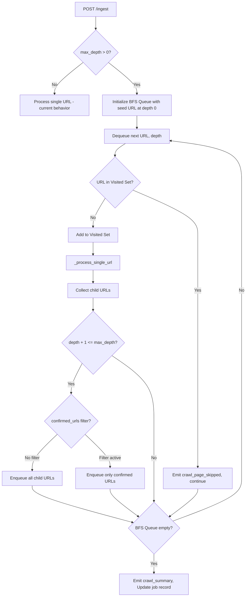
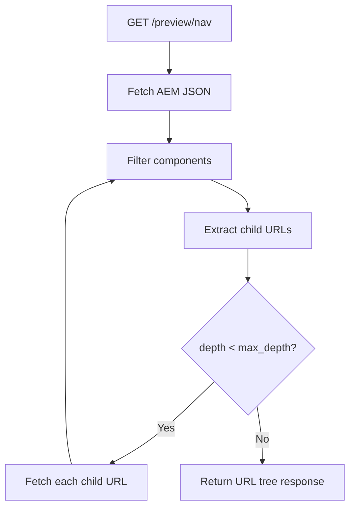
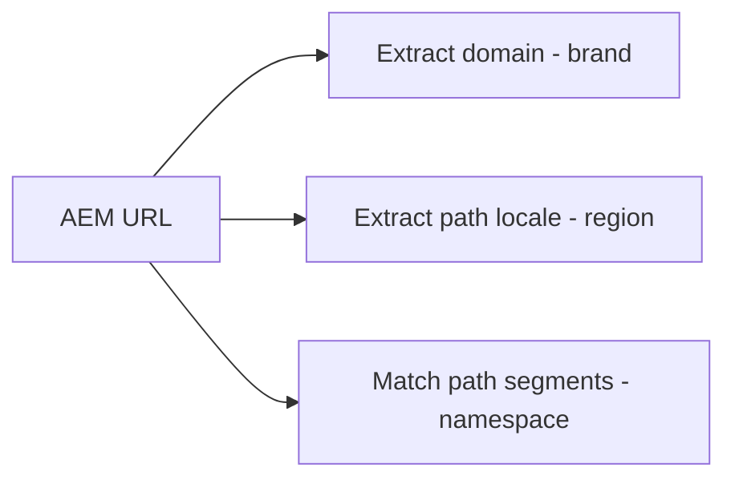

# Design Document: Deep Crawl Ingestion

## Overview

This feature transforms the AEM KB Ingestion System from a single-page-at-a-time processor into an opt-in recursive crawler. Today, the pipeline discovers child URLs from AEM `model.json` link fields but only emits them as SSE events — the user must manually re-submit each one. Deep Crawl Ingestion adds a breadth-first crawl loop inside `PipelineService` that automatically fetches, extracts, and processes discovered child URLs within the same job, up to a configurable depth limit.

The design also introduces:
- A preview endpoint (`GET /preview/nav`) so users can inspect the URL tree before committing to a crawl.
- Selective URL confirmation (`confirmed_urls`) so users choose exactly which child pages to crawl.
- Automatic inference of brand, region, and namespace from the AEM URL, removing manual input fields.
- A revised S3 path structure organized by `{brand}/{region}/{namespace}/{filename}.md`.
- System-level component allowlist/denylist defaults that filter out non-KB-worthy AEM components without user input.

Backward compatibility is preserved: omitting `max_depth` (or setting it to 0) produces identical behavior to the current system.

## Architecture

The crawl loop is implemented as a BFS layer wrapping the existing per-URL processing logic. The current `_run_pipeline` method is refactored so that the per-file extraction-validation-routing flow is extracted into a `_process_single_url` helper. The BFS loop dequeues URLs, calls `_process_single_url`, collects discovered child URLs, and enqueues them at `current_depth + 1` — subject to depth limits, cycle detection, and optional `confirmed_urls` filtering.



### Preview Flow



### URL Inference Flow



## Components and Interfaces

### 1. `IngestRequest` (modified — `src/models/schemas.py`)

Remove `region`, `brand` fields. Add `max_depth` and `confirmed_urls`.

```python
class IngestRequest(BaseModel):
    url: HttpUrl
    max_depth: int = Field(default=0, ge=0)
    confirmed_urls: list[str] | None = None
```

Validation: `max_depth < 0` triggers Pydantic's `ge=0` constraint → 422. Values exceeding `Settings.max_crawl_depth` are clamped in the pipeline, not rejected.

### 2. `Settings` (modified — `src/config.py`)

```python
# New fields added to Settings class
max_crawl_depth: int = 3                          # MAX_CRAWL_DEPTH env var
namespace_list: list[str] = [                      # NAMESPACE_LIST env var
    "locations", "products-and-services", "protections-and-coverages",
    "rental-addons", "long-term-car-rental", "one-way-car-rentals",
    "miles-points-and-partners", "meetings-and-groups", "car-sales",
    "faq", "customer-service", "travel-guides",
]
locale_region_map: dict[str, str] = {              # LOCALE_REGION_MAP env var (JSON)
    "en": "nam", "en-us": "nam", "en-ca": "nam",
    "en-gb": "emea", "en-ie": "emea", "de": "emea", "fr": "emea",
    "en-au": "apac", "en-nz": "apac",
}
component_denylist_defaults: list[str] = [         # AEM_COMPONENT_DENYLIST env var
    "*/loginModal", "*/bookingwidget", "*/image", "*/ghost",
    "*/divider", "*/breadcrumb", "*/languagenavigation",
    "*/experiencefragment", "*/embed", "*/separator", "*/search",
    "*/form", "*/button",
]
component_allowlist_defaults: list[str] = [        # AEM_COMPONENT_ALLOWLIST env var
    "*/text", "*/richtext", "*/accordion", "*/accordionitem",
    "*/faq", "*/table", "*/title", "*/teaser",
    "*/contentcardelement", "*/contentfragmentlist", "*/tabs",
]
```

### 3. `PipelineService` (modified — `src/services/pipeline.py`)

New/changed methods:

```python
class PipelineService:
    async def run(self, job_id, url, max_depth, confirmed_urls, source_id):
        """Entry point — infers brand/region/namespace, clamps depth, delegates."""

    async def _run_pipeline(self, job_id, url, brand, region, namespace,
                            effective_depth, confirmed_urls, source_id):
        """BFS crawl loop wrapping _process_single_url."""

    async def _process_single_url(self, url, brand, region, namespace,
                                   job_id, source_id, parent_url=None) -> list[str]:
        """Extract → validate → route → upload for one URL. Returns child URLs."""
```

Key behaviors:
- `run()` calls `url_inference.infer_brand(url)`, `infer_region(url)`, `infer_namespace(url)` and clamps `max_depth` to `settings.max_crawl_depth`.
- `_run_pipeline()` initializes `bfs_queue: deque[(str, int)]` and `visited: set[str]`, then loops.
- `_process_single_url()` is the extracted per-URL logic from the current `_run_pipeline()`. It passes `parent_url` to the extractor for frontmatter enrichment.

### 4. `url_inference` (new module — `src/utils/url_inference.py`)

```python
def normalize_url(url: str) -> str:
    """Strip trailing slashes, query params, fragments for cycle detection."""

def infer_brand(url: str) -> str:
    """Extract brand from domain: www.avis.com → avis."""

def infer_region(url: str, locale_map: dict[str, str]) -> str:
    """Extract locale from path, map to region code."""

def infer_namespace(url: str, namespace_list: list[str]) -> str:
    """Match URL path segments against namespace list. Default: 'general'."""

def normalize_for_matching(url: str) -> str:
    """Normalize URL for confirmed_urls matching — handles both relative paths and full model.json URLs."""
```

### 5. Preview Endpoint (new — `src/api/preview.py`)

```python
@router.get("/preview/nav")
async def preview_nav(url: str, max_depth: int = 1, request: Request) -> NavPreviewResponse:
    """Lightweight recursive URL discovery without extraction or validation."""
```

This endpoint fetches AEM JSON, runs `filter_by_component_type_direct` + `extract_child_urls` recursively up to `max_depth`, applying the same normalization and cycle detection as the crawl loop. It does not invoke the `ExtractorAgent` or `ValidatorAgent`. Returns a tree structure grouped by depth level.

### 6. `PostProcessor` (modified — `src/agents/extractor.py`)

Updated to accept `namespace` and optional `parent_url` parameters. The YAML frontmatter is revised to include `key`, `namespace`, `brand`, `region`, `source_url`, `parent_context`, and `title` — dropping AEM-specific references like `:type` paths and `dataLayer`.

```python
@staticmethod
def process(results, url, region, brand, namespace, parent_url=None) -> list[MarkdownFile]:
    """Build MarkdownFile objects with revised frontmatter schema."""
```

### 7. `S3UploadService` (modified — `src/services/s3_upload.py`)

Updated `_build_key` to use the new path structure:

```python
@staticmethod
def _build_key(file: MarkdownFile) -> str:
    """Build S3 key: {brand}/{region}/{namespace}/{filename}.md"""
    return f"{file.brand}/{file.region}/{file.namespace}/{file.filename}"
```

### 8. SSE Event Types (new events via `StreamManager`)

| Event | Payload | When |
|---|---|---|
| `crawl_page_start` | `{url, depth, page_index}` | Before processing each BFS URL |
| `crawl_page_complete` | `{url, depth, files_extracted, new_child_urls}` | After processing each BFS URL |
| `crawl_page_skipped` | `{url, reason}` | URL already in visited set |
| `crawl_page_error` | `{url, depth, error}` | Fetch/extraction failure for a URL |
| `crawl_summary` | `{total_pages, total_files, max_depth_reached, skipped_count, failed_count}` | After BFS loop completes |

No changes to `StreamManager` itself — these are new event type strings passed to the existing `publish()` method.

## Data Models

### Modified: `IngestRequest`

```python
class IngestRequest(BaseModel):
    url: HttpUrl
    max_depth: int = Field(default=0, ge=0)
    confirmed_urls: list[str] | None = None
```

Fields removed: `region`, `brand` (now inferred from URL).

### Modified: `MarkdownFile`

```python
class MarkdownFile(BaseModel):
    filename: str
    title: str
    content_type: str
    source_url: str
    component_type: str
    key: str                    # AEM component key (e.g. "contentcardelement_821372053")
    namespace: str              # inferred from URL path
    md_content: str             # full markdown with revised frontmatter
    md_body: str                # markdown body only
    content_hash: str           # SHA-256 of md_body
    extracted_at: datetime
    parent_context: str         # parent page URL if from crawl, else empty
    region: str                 # inferred from URL
    brand: str                  # inferred from URL
```

Fields removed: `aem_node_id`, `modify_date`.
Fields added: `key`, `namespace`.

### Modified: `IngestionJobResponse`

```python
class IngestionJobResponse(BaseModel):
    # ... existing fields ...
    max_depth: int = 0
    pages_crawled: int = 1
    current_depth: int = 0
```

### New: `NavPreviewResponse`

```python
class NavPreviewItem(BaseModel):
    url: str
    depth: int
    parent_url: str | None = None

class NavPreviewResponse(BaseModel):
    root_url: str
    total_urls: int
    urls_by_depth: dict[int, list[NavPreviewItem]]
    summary: dict[int, int]   # depth level → count of URLs at that depth
```

### Database Migration: `003_crawl_tracking.sql`

```sql
ALTER TABLE ingestion_jobs
    ADD COLUMN max_depth       INTEGER NOT NULL DEFAULT 0,
    ADD COLUMN pages_crawled   INTEGER NOT NULL DEFAULT 0,
    ADD COLUMN current_depth   INTEGER NOT NULL DEFAULT 0;
```

### Modified: `kb_files` table

```sql
ALTER TABLE kb_files
    ADD COLUMN key        TEXT,
    ADD COLUMN namespace  TEXT;
```

### YAML Frontmatter Schema (revised)

```yaml
---
key: "contentcardelement_821372053"
namespace: "products-and-services"
brand: "avis"
region: "nam"
source_url: "https://www.avis.com/en/products-and-services/products.model.json"
parent_context: "https://www.avis.com/en/products-and-services.model.json"
title: "Mobile Wi-Fi"
---
```

## Correctness Properties

*A property is a characteristic or behavior that should hold true across all valid executions of a system — essentially, a formal statement about what the system should do. Properties serve as the bridge between human-readable specifications and machine-verifiable correctness guarantees.*

### Property 1: Negative depth rejection

*For any* integer less than 0 provided as `max_depth`, constructing an `IngestRequest` should raise a validation error (Pydantic `ge=0` constraint).

**Validates: Requirements 1.4**

### Property 2: Depth clamping

*For any* non-negative integer `max_depth` and any positive integer `max_crawl_depth` system cap, the effective depth used by the pipeline should equal `min(max_depth, max_crawl_depth)`.

**Validates: Requirements 1.5, 2.2**

### Property 3: BFS ordering and depth limiting

*For any* URL tree (a root URL with child URLs at various depths) and any `max_depth` value, the pipeline should: (a) process all URLs at depth N before any URL at depth N+1, (b) never process a URL at depth greater than `max_depth`, and (c) enqueue discovered child URLs at `current_depth + 1`.

**Validates: Requirements 3.2, 3.3, 3.4**

### Property 4: Cycle detection via URL normalization

*For any* URL that appears multiple times in a URL tree (via circular links), the pipeline should process it exactly once. Additionally, *for any* URL, normalizing it (removing trailing slashes, query parameters, and fragments) should be idempotent: `normalize(normalize(url)) == normalize(url)`.

**Validates: Requirements 4.3, 4.5**

### Property 5: Confirmed URLs filtering

*For any* set of discovered child URLs and any `confirmed_urls` list, the pipeline should only enqueue URLs that are present in both the discovered set and the `confirmed_urls` list (intersection). When `confirmed_urls` is null or empty and `max_depth > 0`, all discovered child URLs should be enqueued.

**Validates: Requirements 3.5, 13.2, 13.4**

### Property 6: Confirmed URLs normalization

*For any* relative path (e.g. `/en/products`) and its equivalent full AEM model.json URL, normalizing both for matching should produce the same canonical form, so that confirmed_urls matching works regardless of input format.

**Validates: Requirements 13.5**

### Property 7: Confirmed URLs respect depth and cycle limits

*For any* `confirmed_urls` list containing URLs that would exceed `max_depth` or that are duplicates (already visited), those URLs should still be filtered out by depth limits and cycle detection respectively.

**Validates: Requirements 13.3**

### Property 8: Error resilience continues crawl

*For any* URL tree where one or more child URLs fail (fetch timeout, HTTP error, invalid JSON, or agent error), the pipeline should continue processing all remaining URLs in the BFS queue. The final job status should be `completed` (not `failed`) as long as the root URL was processed successfully.

**Validates: Requirements 5.4, 12.1, 12.2, 12.4**

### Property 9: Counter accumulation

*For any* sequence of URL processing results (each producing some count of created, approved, pending_review, rejected, and duplicate files), the job-level totals should equal the sum of the individual per-URL counts.

**Validates: Requirements 5.3, 7.4**

### Property 10: SSE crawl events

*For any* crawl job processing N URLs with S skipped (cycle detection) and F failed, the stream manager should emit exactly N `crawl_page_start` events, N `crawl_page_complete` events (for successful URLs), S `crawl_page_skipped` events, F `crawl_page_error` events, and exactly 1 `crawl_summary` event whose totals match `(pages=N, skipped=S, failed=F)`.

**Validates: Requirements 6.1, 6.2, 6.3, 6.4, 12.3**

### Property 11: Brand inference from URL

*For any* AEM URL with domain `www.{brand}.com`, `infer_brand(url)` should return `{brand}`.

**Validates: Requirements 15.1**

### Property 12: Region inference from URL

*For any* AEM URL containing a locale path segment present in the `locale_region_map`, `infer_region(url, map)` should return the corresponding region code.

**Validates: Requirements 15.2**

### Property 13: Namespace inference from URL

*For any* AEM URL, `infer_namespace(url, namespace_list)` should return the first path segment that matches an entry in `namespace_list`, or `"general"` if no segment matches.

**Validates: Requirements 15.3, 15.5**

### Property 14: S3 key structure

*For any* `MarkdownFile` with non-empty `brand`, `region`, `namespace`, and `filename`, the S3 key should equal `{brand}/{region}/{namespace}/{filename}`.

**Validates: Requirements 16.1**

### Property 15: Frontmatter correctness

*For any* `MarkdownFile` produced by the `PostProcessor`, the YAML frontmatter should contain exactly the fields `key`, `namespace`, `brand`, `region`, `source_url`, `parent_context`, and `title`, and should NOT contain AEM-specific fields such as `:type`, `dataLayer`, `repo:modifyDate`, or `aem_node_id`.

**Validates: Requirements 16.2, 16.3, 16.4**

### Property 16: Parent context enrichment

*For any* child URL processed during a crawl (depth > 0), the resulting `MarkdownFile` objects should have `parent_context` set to the URL of the page that linked to it. For the root URL (depth 0), `parent_context` should be empty.

**Validates: Requirements 9.1, 9.2**

### Property 17: Component filtering by allowlist/denylist

*For any* AEM JSON tree and any allowlist/denylist configuration, `filter_by_component_type_direct` should include only nodes whose `:type` suffix matches the allowlist and does not match the denylist. Nodes whose only meaningful fields are i18n keys or configuration objects (containing only `i18n`, `dataLayer`, `appliedCssClassNames`, or only `id` and `:type` with no text content) should be excluded.

**Validates: Requirements 14.1, 14.2, 14.3**

### Property 18: Multi-file pipeline handling

*For any* extraction that returns N `MarkdownFile` objects from a single URL, the pipeline should independently validate, route, and upload each of the N files, resulting in N separate DB records and (for approved files) N separate S3 uploads.

**Validates: Requirements 17.5**

### Property 19: Preview matches crawl discovery

*For any* URL tree and `max_depth`, the set of URLs returned by the `GET /preview/nav` endpoint should be identical to the set of URLs that the crawl loop would discover (using the same normalization and cycle detection logic), excluding any `confirmed_urls` filtering.

**Validates: Requirements 11.6**

### Property 20: Persisted effective depth

*For any* ingestion job, the `max_depth` value stored in the `ingestion_jobs` DB record should equal the effective (clamped) depth, i.e. `min(requested_max_depth, settings.max_crawl_depth)`.

**Validates: Requirements 7.5**

## Error Handling

### Fetch/Extraction Errors During Crawl

When `_process_single_url` encounters an error (HTTP timeout, non-200 status, invalid JSON, or `ExtractorAgent` failure):
1. Log the error with URL and depth context.
2. Emit a `crawl_page_error` SSE event with `{url, depth, error}`.
3. Increment the failed URL counter.
4. Continue processing the next URL in the BFS queue — do not abort the crawl.

### Root URL Failure

If the root URL (depth 0) fails, the job is marked as `failed` with the error message. No child URLs are processed.

### Preview Endpoint Errors

- Unreachable AEM URL or invalid JSON → HTTP 502 with descriptive message.
- Timeout → HTTP 502 with timeout message (uses `aem_request_timeout`).
- Invalid URL format → HTTP 422 via Pydantic validation.

### Depth Clamping (not an error)

When `max_depth > settings.max_crawl_depth`, the value is silently clamped. This is logged at INFO level but not surfaced as an error to the client. The effective depth is persisted in the job record for auditability.

### Validation/Upload Errors for Individual Files

Existing behavior is preserved: if validation or S3 upload fails for a single file, the error is logged, the file retains `pending_review` status, and processing continues with the next file.

## Testing Strategy

### Property-Based Testing

Library: [Hypothesis](https://hypothesis.readthedocs.io/) (Python PBT framework).

Each correctness property from the design document is implemented as a single Hypothesis test with a minimum of 100 examples per run. Tests are tagged with comments referencing the design property:

```python
# Feature: deep-crawl-ingestion, Property 4: Cycle detection via URL normalization
@given(url=st.text(min_size=1).map(lambda s: f"https://example.com/{s}"))
@settings(max_examples=100)
def test_url_normalization_idempotent(url):
    assert normalize_url(normalize_url(url)) == normalize_url(url)
```

Property tests focus on:
- URL inference functions (`infer_brand`, `infer_region`, `infer_namespace`, `normalize_url`)
- Depth clamping logic
- BFS ordering guarantees (using mock URL trees)
- Confirmed URLs intersection logic
- S3 key construction
- Frontmatter field inclusion/exclusion
- Counter accumulation arithmetic
- Component filtering with allowlist/denylist

### Unit Tests

Unit tests complement property tests for specific examples and edge cases:
- Backward compatibility: `max_depth=0` produces identical behavior to current system
- Settings defaults: `max_crawl_depth=3`, `namespace_list` contains expected values
- DB migration: new columns exist with correct defaults
- Preview endpoint: returns 502 for unreachable URLs, correct tree structure for known URL trees
- SSE events: correct event types and payloads for known crawl scenarios
- Schema validation: `IngestRequest` rejects negative `max_depth`, accepts missing `max_depth`
- `IngestionJobResponse` includes new fields with correct defaults

### Test Organization

```
tests/
  test_utils/
    test_url_inference.py          # Properties 11-13, unit tests for inference
  test_services/
    test_pipeline_crawl.py         # Properties 3, 4, 5, 7, 8, 9, 10, 18
    test_s3_upload.py              # Property 14
  test_models/
    test_schemas.py                # Properties 1, 2, unit tests for models
  test_tools/
    test_filter_components.py      # Property 17
  test_api/
    test_preview.py                # Property 19, unit tests for preview endpoint
  test_agents/
    test_post_processor.py         # Properties 15, 16
```

### Integration Tests

End-to-end tests using mocked AEM JSON responses to verify:
- Full crawl loop with depth 2 and a known URL tree
- Confirmed URLs filtering with mixed relative/absolute URLs
- Error resilience with one failing child URL
- Preview endpoint returning correct tree for a known structure
