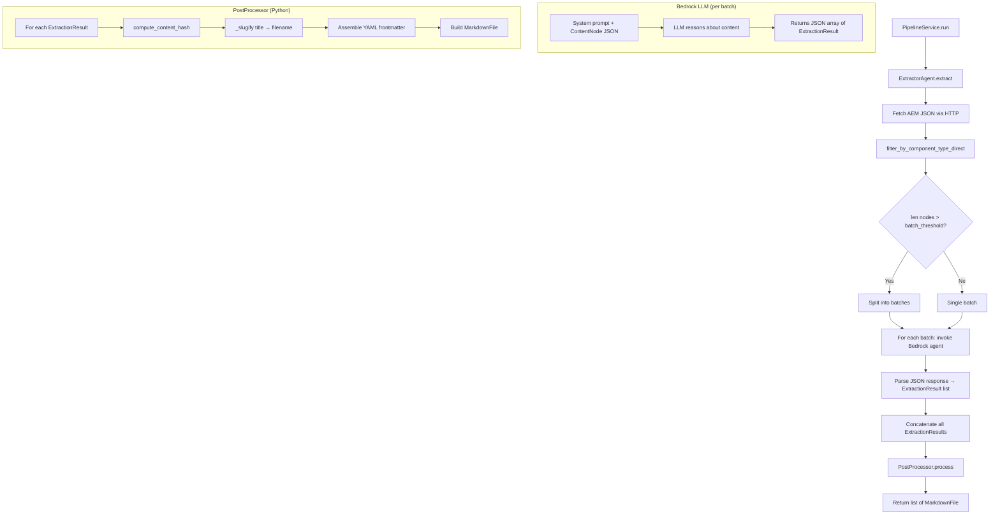
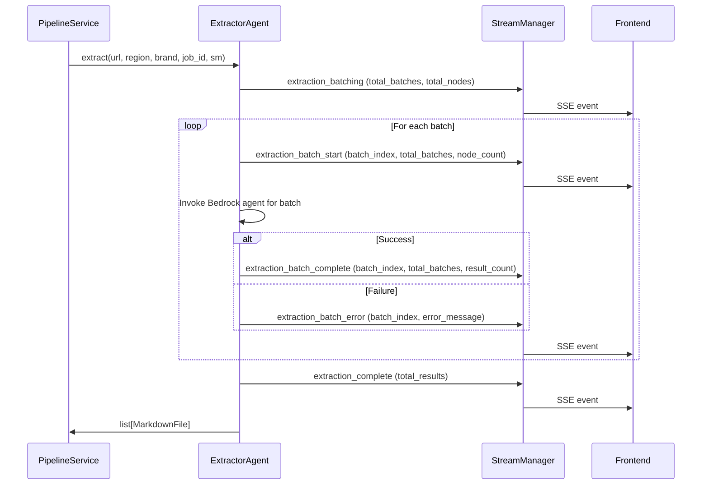
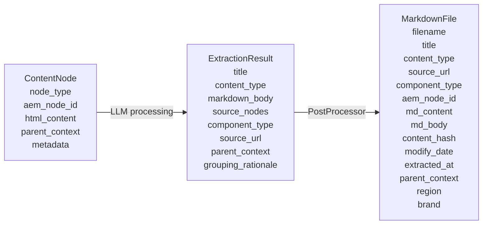

# Design Document: Extractor Agent Refactor

## Overview

This design refactors the Extractor Agent from a tool-delegating Strands agent into an LLM-first content processor. The current architecture uses two Strands tools (`html_to_markdown` and `generate_md_file`) in a rigid 1:1 node-to-file mapping where the LLM orchestrates deterministic tool calls. The refactored architecture feeds raw filtered AEM `ContentNode` JSON directly into the Bedrock LLM prompt, letting the model perform all content understanding (HTML→markdown conversion, metadata inference, intelligent file grouping/splitting) and return structured JSON. A Python `PostProcessor` then handles the deterministic work: SHA-256 hashing, filename slugification, YAML frontmatter assembly, and `MarkdownFile` construction.

Large node sets are batched into sequential agent calls (configurable threshold, default 8) to stay within Bedrock context/token limits. SSE events provide batch-level progress to the frontend. The `extract()` method signature and return type (`list[MarkdownFile]`) remain unchanged, preserving full pipeline compatibility.

### Key Design Decisions

| Decision | Rationale |
|---|---|
| Zero Strands tools | Eliminates tool-call overhead and rigid 1:1 mapping; lets the LLM reason holistically about content grouping |
| Raw JSON in prompt | ContentNodes are small after filtering; direct prompt injection avoids tool serialization round-trips |
| Python PostProcessor | Hashing, slugification, and frontmatter are deterministic — no reason to burn LLM tokens on them |
| Sequential batching | Respects Bedrock API throttling; simpler error isolation per batch |
| Configurable batch threshold | Operators can tune based on model context window without code changes |

## Architecture

### High-Level Flow



### SSE Event Flow for Batched Extraction



## Components and Interfaces

### 1. ExtractorAgent (refactored)

**Location:** `src/agents/extractor.py`

```python
class ExtractorAgent:
    def __init__(self, settings: Settings) -> None:
        """Initialize with Settings. No tools registered."""

    async def extract(
        self,
        url: str,
        region: str,
        brand: str,
        job_id: UUID | None = None,
        stream_manager: StreamManager | None = None,
    ) -> list[MarkdownFile]:
        """Fetch AEM JSON, filter, batch, invoke agent, post-process.
        
        Returns list[MarkdownFile] — same signature as before.
        """

    def _build_prompt(
        self,
        nodes: list[ContentNode],
        url: str,
        region: str,
        brand: str,
    ) -> str:
        """Serialize ContentNodes to JSON and build the user prompt."""

    async def _invoke_agent(self, prompt: str, job_id, sm) -> list[ExtractionResult]:
        """Invoke Bedrock agent with zero tools, parse JSON response."""

    @staticmethod
    def _parse_response(response_text: str) -> list[ExtractionResult]:
        """Extract JSON array from response text, validate each element
        against ExtractionResult Pydantic model. Handles preamble/postamble
        text around the JSON array. Returns empty list on parse failure."""
```

The agent is instantiated with an empty tools list (`tools=[]`). The system prompt instructs the LLM to:
1. Convert HTML content to clean markdown
2. Infer `title` and `content_type` from content
3. Decide how to group or split nodes into logical files
4. Return a JSON array of `ExtractionResult` objects

### 2. PostProcessor (new)

**Location:** `src/agents/extractor.py` (co-located with ExtractorAgent)

```python
class PostProcessor:
    @staticmethod
    def process(
        results: list[ExtractionResult],
        url: str,
        region: str,
        brand: str,
    ) -> list[MarkdownFile]:
        """Convert ExtractionResults into MarkdownFiles.
        
        For each ExtractionResult:
        1. Compute SHA-256 hash of markdown_body
        2. Slugify title → filename.md
        3. Assemble YAML frontmatter with all required metadata
        4. Join source_nodes into comma-separated aem_node_id
        5. Build MarkdownFile
        """
```

The PostProcessor imports `_slugify` and `compute_content_hash` from the deprecated tool modules as plain Python functions.

### 3. ExtractionResult (new Pydantic model)

**Location:** `src/models/schemas.py`

```python
class ExtractionResult(BaseModel):
    title: str
    content_type: str
    markdown_body: str  # must be non-empty (validator)
    source_nodes: list[str]  # aem_node_ids that contributed
    component_type: str
    source_url: str
    parent_context: str
    grouping_rationale: str

    @field_validator("markdown_body")
    @classmethod
    def markdown_body_not_empty(cls, v: str) -> str:
        if not v.strip():
            raise ValueError("markdown_body must not be empty")
        return v
```

### 4. Settings (extended)

**Location:** `src/config.py`

```python
# New field added to Settings class:
batch_threshold: int = 8  # env var: BATCH_THRESHOLD

@field_validator("batch_threshold")
@classmethod
def batch_threshold_min(cls, v: int) -> int:
    return max(1, v)
```

### 5. Deprecated Tool Modules (modified)

**`src/tools/html_converter.py`:** Remove `@tool` decorator from `html_to_markdown`. Retain the underlying function as a plain Python utility (it may still be useful for other modules or testing).

**`src/tools/md_generator.py`:** Remove `@tool` decorator from `generate_md_file`. The `_slugify` and `compute_content_hash` functions are retained as importable utilities for the PostProcessor.

### 6. Unchanged Components

- `src/tools/filter_components.py` — stays as-is
- `src/services/pipeline.py` — calls `extractor.extract()` with same signature
- `src/services/stream_manager.py` — used for SSE publishing, no changes
- Validator Agent, score routing, S3 upload — all unchanged

## Data Models

### ExtractionResult (Agent Output)

| Field | Type | Description |
|---|---|---|
| `title` | `str` | Inferred document title |
| `content_type` | `str` | Inferred content type (e.g., "FAQ", "Product Guide") |
| `markdown_body` | `str` | Clean markdown content (non-empty, validated) |
| `source_nodes` | `list[str]` | AEM node IDs that contributed to this file |
| `component_type` | `str` | AEM component type |
| `source_url` | `str` | Source AEM URL |
| `parent_context` | `str` | Parent node path context |
| `grouping_rationale` | `str` | LLM's reasoning for grouping/splitting decisions |

### MarkdownFile (Existing, Unchanged)

| Field | Type | Source |
|---|---|---|
| `filename` | `str` | PostProcessor: `_slugify(title) + ".md"` |
| `title` | `str` | ExtractionResult.title |
| `content_type` | `str` | ExtractionResult.content_type |
| `source_url` | `str` | ExtractionResult.source_url |
| `component_type` | `str` | ExtractionResult.component_type |
| `aem_node_id` | `str` | PostProcessor: `",".join(source_nodes)` |
| `md_content` | `str` | PostProcessor: frontmatter + markdown_body |
| `md_body` | `str` | ExtractionResult.markdown_body |
| `content_hash` | `str` | PostProcessor: `compute_content_hash(markdown_body)` |
| `modify_date` | `datetime` | From ContentNode metadata or current UTC |
| `extracted_at` | `datetime` | Current UTC timestamp |
| `parent_context` | `str` | ExtractionResult.parent_context |
| `region` | `str` | Passed through from extract() call |
| `brand` | `str` | Passed through from extract() call |

### Data Flow Transformation



### Batching Configuration

| Setting | Type | Default | Env Var | Constraint |
|---|---|---|---|---|
| `batch_threshold` | `int` | `8` | `BATCH_THRESHOLD` | Minimum 1 (values < 1 clamped to 1) |


## Correctness Properties

*A property is a characteristic or behavior that should hold true across all valid executions of a system — essentially, a formal statement about what the system should do. Properties serve as the bridge between human-readable specifications and machine-verifiable correctness guarantees.*

### Property 1: Prompt contains raw ContentNode JSON

*For any* list of ContentNodes, the prompt built by `_build_prompt` should contain the JSON serialization of those nodes and should not contain references to `html_to_markdown` or `generate_md_file` tool calls.

**Validates: Requirements 1.1**

### Property 2: Response parsing round-trip with preamble/postamble

*For any* valid JSON array of ExtractionResult dicts and *for any* arbitrary preamble and postamble strings (not containing `[` or `]`), wrapping the JSON array with the preamble and postamble and passing it to `_parse_response` should recover the original ExtractionResult objects.

**Validates: Requirements 3.1, 3.2**

### Property 3: Invalid JSON returns empty list

*For any* string that does not contain a valid JSON array, `_parse_response` should return an empty list without raising an exception.

**Validates: Requirements 3.3**

### Property 4: Partial validity — skip invalid elements

*For any* JSON array containing a mix of valid ExtractionResult dicts and invalid dicts (missing required fields or empty markdown_body), `_parse_response` should return only the valid ExtractionResult objects and skip the invalid ones.

**Validates: Requirements 3.4**

### Property 5: PostProcessor produces correct MarkdownFile fields

*For any* ExtractionResult with non-empty markdown_body, the PostProcessor should produce a MarkdownFile where:
- `content_hash` equals `SHA-256(markdown_body)`
- `filename` equals `_slugify(title) + ".md"`
- `md_body` equals `markdown_body`
- `aem_node_id` equals `",".join(source_nodes)`
- `md_content` contains YAML frontmatter with all required metadata fields (title, content_type, source_url, component_type, aem_node_id, modify_date, extracted_at, parent_context, region, brand) followed by the markdown body

**Validates: Requirements 2.2, 2.3, 2.4, 2.6, 8.2**

### Property 6: PostProcessor count invariant

*For any* list of ExtractionResults, the PostProcessor should produce exactly `len(results)` MarkdownFile objects — one per ExtractionResult.

**Validates: Requirements 2.5**

### Property 7: Batch splitting correctness

*For any* list of ContentNodes and *for any* batch_threshold ≥ 1:
- If `len(nodes) > batch_threshold`, the nodes are split into `ceil(len(nodes) / batch_threshold)` batches, each of size `batch_threshold` except the last which may be smaller.
- If `len(nodes) <= batch_threshold`, exactly 1 batch is produced containing all nodes.
- The concatenation of all batches equals the original node list (no nodes lost or reordered).

**Validates: Requirements 4.1, 4.3, 4.6**

### Property 8: Failed batch does not prevent other batches

*For any* set of batches where one batch invocation raises an exception, the results from all other successful batches should still be present in the final concatenated result list.

**Validates: Requirements 4.4**

### Property 9: SSE events match batch count

*For any* N batches processed, the StreamManager should receive exactly N `extraction_batch_start` events and exactly N `extraction_batch_complete` or `extraction_batch_error` events (one per batch), plus one `extraction_batching` event at the start and one `extraction_complete` event at the end.

**Validates: Requirements 5.1, 5.2, 5.3, 5.5**

### Property 10: ExtractionResult model validation

*For any* dict with all required fields (title, content_type, markdown_body, source_nodes, component_type, source_url, parent_context, grouping_rationale) where markdown_body is non-empty, ExtractionResult construction should succeed. *For any* dict missing a required field or with an empty/whitespace-only markdown_body, construction should raise a ValidationError.

**Validates: Requirements 6.1, 6.3**

### Property 11: Batch threshold clamping

*For any* integer value less than 1, the Settings class should clamp `batch_threshold` to 1.

**Validates: Requirements 7.3**

## Error Handling

### JSON Parse Errors

When the Bedrock LLM returns a response that cannot be parsed as valid JSON:
- Log the raw response text at ERROR level for debugging
- Return an empty `list[ExtractionResult]` for that batch
- Do not raise an exception — let the pipeline continue with other batches

### Individual Element Validation Errors

When a JSON element fails Pydantic validation against `ExtractionResult`:
- Log a WARNING with the element index and validation error details
- Skip the invalid element
- Continue processing remaining elements in the array

### Batch Invocation Failures

When a Bedrock agent invocation fails for a batch (API error, timeout, etc.):
- Log the error at ERROR level with batch index and node count
- Publish an `extraction_batch_error` SSE event
- Skip the failed batch entirely
- Continue processing remaining batches
- The final result list will contain results from all successful batches only

### HTTP Fetch Errors

When the AEM JSON fetch fails (timeout, non-200 status, invalid JSON):
- Raise `ToolError` with a descriptive message (existing behavior, unchanged)
- The PipelineService catches this and marks the job as failed

### Empty Results

When no ExtractionResults are produced (all batches fail or LLM returns empty arrays):
- Return an empty `list[MarkdownFile]`
- The PipelineService handles this gracefully (0 files created)

## Testing Strategy

### Property-Based Testing

Use `hypothesis` as the property-based testing library. Each property test should run a minimum of 100 iterations.

Each property test must be tagged with a comment referencing the design property:
```python
# Feature: extractor-agent-refactor, Property N: <property_text>
```

Property tests cover:
- **Property 1**: Generate random ContentNode lists, verify prompt construction
- **Property 2**: Generate random valid ExtractionResult dicts, serialize to JSON, wrap with random preamble/postamble, verify round-trip parsing
- **Property 3**: Generate random non-JSON strings, verify empty list return
- **Property 4**: Generate mixed arrays of valid/invalid dicts, verify only valid ones are returned
- **Property 5**: Generate random ExtractionResults, run through PostProcessor, verify all MarkdownFile fields
- **Property 6**: Generate random-length ExtractionResult lists, verify output count matches input count
- **Property 7**: Generate random node lists and thresholds, verify batch splitting correctness
- **Property 8**: Mock batch invocations with random failures, verify surviving results
- **Property 9**: Mock StreamManager, run batched extraction, verify SSE event counts
- **Property 10**: Generate random dicts with/without required fields, verify ExtractionResult validation
- **Property 11**: Generate random non-positive integers, verify clamping to 1

### Unit Testing

Unit tests complement property tests for specific examples and edge cases:

- **System prompt content**: Verify the system prompt contains required instructions (Req 1.2)
- **Zero tools registration**: Verify agent is instantiated with `tools=[]` (Req 1.4, 2.1)
- **Batch threshold default**: Verify Settings defaults to `batch_threshold=8` (Req 4.5, 7.1)
- **Environment variable loading**: Verify `BATCH_THRESHOLD` env var is picked up (Req 7.2)
- **SSE event shapes**: Verify specific SSE event payloads for extraction_batching, extraction_batch_error (Req 5.1, 5.4)
- **Edge case — single node**: Verify single ContentNode produces single MarkdownFile
- **Edge case — empty node list**: Verify empty input produces empty output
- **Edge case — batch boundary**: Verify exactly `batch_threshold` nodes produces 1 batch, `batch_threshold + 1` produces 2 batches
- **Integration**: End-to-end test with mocked Bedrock agent verifying full extract() → MarkdownFile flow
