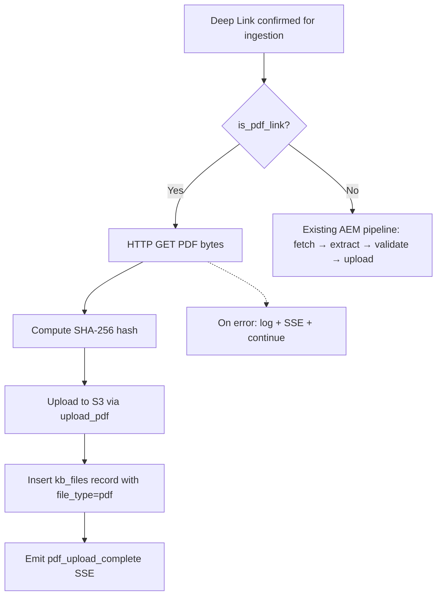

# Design Document: PDF Deep Link Storage

## Overview

This feature adds a PDF-specific branch to the ingestion pipeline. When a confirmed deep link URL has a `.pdf` extension, the system bypasses the LLM extraction/validation pipeline entirely and instead downloads the raw PDF binary, uploads it to S3, and inserts a `kb_files` record with `file_type='pdf'`. Metadata (brand, region, namespace) is inferred from the parent source URL, not from the PDF content. The PDF appears in the unified "all files" listing alongside markdown files.

## Architecture

The change introduces a branching point in the pipeline's deep link processing. Before a deep link enters the AEM JSON fetch → extract → validate flow, the URL is checked for a `.pdf` extension. PDFs take a short-circuit path: download bytes → hash → upload to S3 → insert DB record.



## Components and Interfaces

### 1. `is_pdf_link` (new function — `src/utils/url_inference.py`)

```python
def is_pdf_link(url: str) -> bool:
    """Return True if the URL path ends with .pdf (case-insensitive).

    Strips query parameters, fragments, and trailing slashes before checking.
    """
```

Simple URL path parsing — no HTTP requests. Uses `urlparse` to extract the path, strips trailing slashes, and checks `.lower().endswith(".pdf")`.

### 2. `S3UploadService.upload_pdf` (new method — `src/services/s3_upload.py`)

```python
async def upload_pdf(
    self,
    pdf_bytes: bytes,
    filename: str,
    brand: str,
    region: str,
    namespace: str,
    file_id: UUID,
    content_hash: str,
) -> S3UploadResult:
    """Upload raw PDF bytes to S3.

    Key pattern: {brand}/{region}/{namespace}/{filename}
    ContentType: application/pdf
    """
```

The filename is pre-built by the caller as `{hash_prefix}_{original_name}.pdf`. This method just uploads the bytes and returns the `S3UploadResult`.

### 3. `PipelineService._process_pdf_link` (new method — `src/services/pipeline.py`)

```python
async def _process_pdf_link(
    self,
    url: str,
    brand: str,
    region: str,
    namespace: str,
    job_id: UUID,
    source_id: UUID | None,
) -> None:
    """Download a PDF deep link, upload to S3, and insert a kb_files record.

    Steps:
    1. Emit pdf_download SSE event
    2. HTTP GET the PDF URL → raw bytes
    3. Compute SHA-256 hash of bytes
    4. Build filename: {hash[:8]}_{url_filename}.pdf
    5. Insert kb_files record (file_type='pdf', status='approved',
       md_content=None, validation_score=None)
    6. Upload to S3 via upload_pdf
    7. Update kb_files with S3 metadata
    8. Emit pdf_upload_complete SSE event

    On error: log, emit pdf_download_error SSE, return without raising.
    """
```

### 4. Pipeline branching (modified — `src/services/pipeline.py`)

The branching happens wherever confirmed deep links are processed for ingestion. Before calling the existing AEM extraction path for a deep link URL, check `is_pdf_link(url)`:

- If `True` → call `_process_pdf_link`
- If `False` → existing `_process_single_url` path

### 5. Database migration

Add `file_type` column to `kb_files`:

```sql
ALTER TABLE kb_files ADD COLUMN file_type TEXT NOT NULL DEFAULT 'markdown';
```

Existing rows get `'markdown'`. New PDF rows get `'pdf'`.

Also ensure `md_content`, `md_body`, `title`, `content_type`, `component_type`, `key`, `validation_score`, and `validation_breakdown` are nullable on the `kb_files` table (some may already be). PDFs will have these as NULL.

### 6. Schema model updates (`src/models/schemas.py`)

- `FileSummary`: add `file_type: str = "markdown"`
- `FileDetail`: add `file_type: str = "markdown"`, ensure `md_content`, `validation_score`, `validation_breakdown` are `Optional`

### 7. DB model update (`src/db/models.py`)

- `KBFile`: add `file_type: Mapped[str]` column with `server_default=text("'markdown'")`
- Ensure nullable columns are properly typed for PDF records

## Data Models

### Modified: `KBFile` (DB model)

```python
file_type: Mapped[str] = mapped_column(
    Text, nullable=False, server_default=text("'markdown'")
)
```

### Modified: `FileSummary` (response model)

```python
class FileSummary(BaseModel):
    # ... existing fields ...
    file_type: str = "markdown"
```

### Modified: `FileDetail` (response model)

```python
class FileDetail(BaseModel):
    # ... existing fields ...
    file_type: str = "markdown"
    md_content: str | None = None        # NULL for PDFs
    validation_score: float | None = None # NULL for PDFs
    validation_breakdown: dict | None = None  # NULL for PDFs
```

### S3 Key Pattern

- Markdown: `{brand}/{region}/{namespace}/{filename}.md` (unchanged)
- PDF: `{brand}/{region}/{namespace}/{hash[:8]}_{original_filename}.pdf`

## Error Handling

### PDF Download Failure

When the HTTP GET for a PDF fails (timeout, non-200 status, connection error):
1. Log the error with URL context.
2. Emit `progress` SSE event with `stage: "pdf_download_error"`.
3. Do NOT insert a `kb_files` record (no partial records for failed downloads).
4. Continue processing remaining deep links — do not abort the job.

### S3 Upload Failure for PDF

When the S3 `put_object` fails:
1. Log the error.
2. The `kb_files` record remains without S3 metadata (same pattern as existing markdown upload failures).
3. Continue processing.

## Correctness Properties

### Property 1: PDF detection accuracy

*For any* URL string, `is_pdf_link(url)` should return `True` if and only if the URL path (after removing query params, fragments, and trailing slashes) ends with `.pdf` (case-insensitive).

**Validates: Requirements 1.1, 1.2, 1.3**

### Property 2: PDF bypass of LLM pipeline

*For any* deep link identified as a PDF, the pipeline should NOT invoke the ExtractorAgent, ValidatorAgent, or markdown PostProcessor. The PDF bytes should be stored as-is.

**Validates: Requirements 2.2**

### Property 3: S3 key uniqueness via hash prefix

*For any* two distinct PDF files with the same original filename, the S3 keys should differ because the SHA-256 hash prefix will differ.

**Validates: Requirements 2.4**

### Property 4: DB record completeness for PDFs

*For any* successfully uploaded PDF, the `kb_files` record should have `file_type='pdf'`, `status='approved'`, non-null `s3_key`, non-null `content_hash`, and null `validation_score`.

**Validates: Requirements 3.2, 3.3, 3.4, 3.5**

### Property 5: Backward compatibility for non-PDF links

*For any* deep link URL that does not end in `.pdf`, the pipeline behavior should be identical to the pre-feature behavior.

**Validates: Requirements 7.1, 7.2**

### Property 6: File listing includes both types

*For any* query to the file listing endpoint, the response should include both `markdown` and `pdf` records, each with a `file_type` field.

**Validates: Requirements 6.1, 6.2**

## Testing Strategy

### Unit Tests

- `is_pdf_link`: test with `.pdf`, `.PDF`, `.Pdf`, `.pdf?query=1`, `.pdf#anchor`, `/path/to/file.pdf/`, non-PDF extensions, no extension, empty string
- `upload_pdf`: mock S3 client, verify `ContentType`, key pattern, metadata
- `_process_pdf_link`: mock HTTP response, verify S3 upload called with correct bytes, DB record inserted with correct fields
- Pipeline branching: verify PDF links go to `_process_pdf_link`, non-PDF links go to `_process_single_url`

### Integration Tests

- End-to-end: mock a deep link with `.pdf` URL, verify PDF bytes land in S3 and `kb_files` record has `file_type='pdf'`
- Error case: mock a failing PDF download, verify job continues and no `kb_files` record is created
- File listing: verify both markdown and PDF records appear with correct `file_type`
